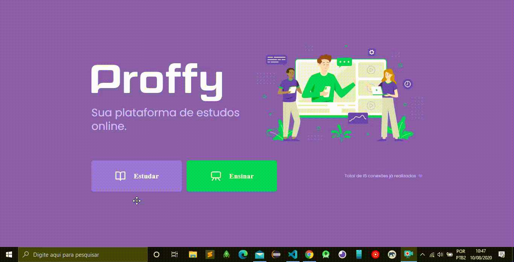

<h1 align=center>


---

🚀 Projeto com API, versão WEB e Mobile - Com NodeJS, ReactJS e ReactNative ✔️ <br>


</h1>

## 📑️ Índice

- [O projeto](#📝️-Sobre)
- [Tecnologias utilizadas](#🚀️-Tecnologias-utilizadas)
- [Acrescentado ao projeto original](#💻️-Acrescentado-ao-projeto-original)
- [Como usar](#💾️-Como-baixar/testar-o-projeto)
- [NLW#2](#ℹ️-NLW-O-que-é-a-Next-Level-Week?)
- [Contato](#-Desenvolvido-com-💙️-por)
- [Licença](#-Licença)

---

## 📝️ Sobre

O projeto trata-se de uma aplicação com API, versão WEB e mobile, onde ambos consomem a API.
A aplicação é uma ferramenta de cadastro e busca de professores para aulas particulares.

## Apresentação da Versão WEB

<h1>

</h1>

---

## Apresentação da Versão Mobile

<h1 align=center>

</h1>

---

## 🚀️ Tecnologias utilizadas

O projeto foi desenvolvido utilizando as seguintes tecnologias:

- TypeScript
- NodeJS
- Express
- Knex
- Axios
- Sqlite3
- CSS
- ReactJS
- ReactNative
- Expo
- Yarn

---

## 💻️ Acrescentado ao projeto proposto

- Em breve melhorias e implementações dos desafios, através do link:

<ol>
  <li>
    <a href="https://www.notion.so/Vers-o-2-0-Proffy-eefca1b981694cd0a895613bc6235970">Acessar desafios</a>
  </li>
</ol>

---

## 💾️ Como baixar/testar o projeto

- Você irá precisar instalar o [Git](https://git-scm.com/), [NodeJS](https://nodejs.org/pt-br/download/), [Yarn](https://classic.yarnpkg.com/pt-BR/docs/install/#alternatives-stable), [Expo](https://docs.expo.io/get-started/installation/) + [Visual Studio code](https://code.visualstudio.com/).

```bash
# Versões mínimas ou superiores.
$ node -v
v12.18.3

$ npm -v
6.14.5

$ yarn -v
1.22.4

$ expo --version
3.23.3

$ git --version
2.27.0
```

- Para configurar, no bash digite os seguinte códigos:

```bash
# Clonar o repositório
$ git clone https://github.com/RicardoMejolaro/Projeto-Proffy.git

#Entrar no diretório
$ cd project

#Abrir projeto no VsCode ou com seu prompt de comando de preferência
code . ||  cd project (Passo acima) 

#Primeiramente iniciar o Servidor(api) *Entrar no diretório:
$ cd api

#Com o terminal aberto rodar o comando
$ yarn install (para instalar as dependências necessárias)

#Agora só rodar a api com o comando
$ yarn start, no console log aparecerá 'Server is running'.
Api está online.

#Testar versão WEB. *Entrar no diretório:
$ cd web

#Com o terminal aberto rodar o comando
$ yarn install (para instalar as dependências necessárias)

#Agora só rodar o projeto com o comando
$ yarn start

#Pronto projeto abrirá em seu navegador padrão
Agora é só testar em seu navegador!

#Testar versão Mobile. *Entrar no diretório:
$ cd mobile

#Com o terminal aberto rodar o comando
$ yarn install (para instalar as dependências necessárias)

#Agora só rodar o projeto com o comando
$ yarn start

#Baixar o app do EXPO em seu smartphone
$ Escanear o QRCode que aparecerá no console log ou na aba web do se navegador.

#Observação
$ O seu PC e seu Smartphone devem estar conectados na mesma rede.

#Pronto projeto abrirá em seu smartphone
Agora é só testar em seu navegador!

```
---

<h1 align=center>


## ℹ️ NLW O que é a Next Level Week?
Next Level Week (NLW) é uma semana prática com muito código e desafios, onde tem como um único objetivo: levá-lo ao próximo nível.

Através do método da Rocketseat, aprenderemos novas ferramentas, novas tecnologias e descobriremos hacks que irão impulsionar sua carreira. Um evento online e totalmente gratuito que o ajudará a dar o próximo passo na sua evolução como desenvolvedor.

---

### Desenvolvido com 💙️ por

***Ricardo Mejolaro*** 
<br/> 
<a href="https://www.linkedin.com/in/ricardo-mejolaro/">

</a>

### Licença

Este projeto está licenciado sob a licença MIT - consulte a página [LICENSE](https://opensource.org/licenses/MIT) para obter detalhes.
